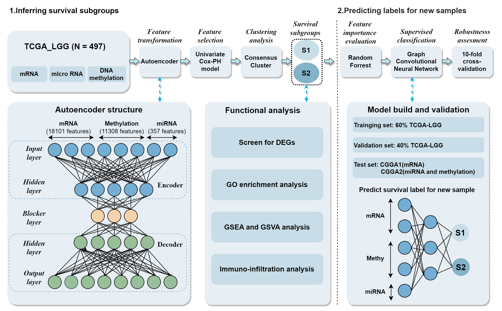

# Integration of multi-omics data based on deep learning for subtyping of low-grade glioma

This is the code repository of the paper *Integration of multi-omics data based on deep learning for subtyping of low-grade glioma*. 
**Mosurv:The classifier for low-grade glioma survival subgroups** 
**Cluster：Inferring survival subgroups for low-grade glioma patients.** 
**Select_predict_factor:Select predictive factors for the classifier based on the feature importance ranking of random forest.** 
**Classfier：Predicting labels for new samples based on Multi-omics algorithm named MOGONET.** 

MOGONET algorithm can be found in [MOGONET](https://github.com/txWang/MOGONET). 

## Workflow

## Contact
If you have any questions, please feel free to get touch with me: musuli@stu.njmu.edu.cn.
