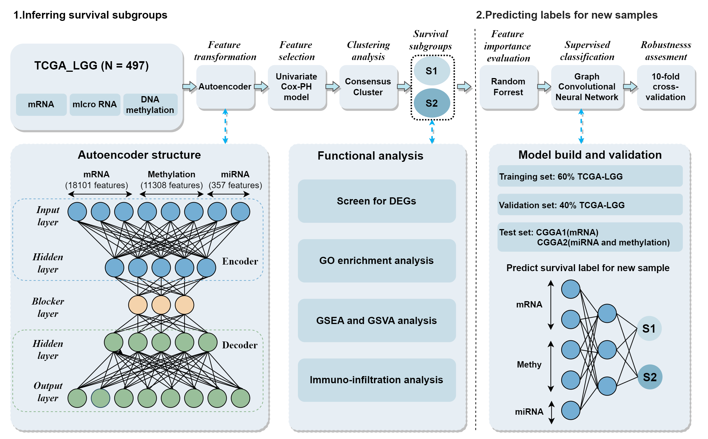

# Integration of multi-omics data based on deep learning for subtyping of low-grade glioma

This is the code repository of the paper *Integration of multi-omics data based on deep learning for subtyping of low-grade glioma*. 
**Mosurv:The classifier for low-grade glioma survival subgroups** 
**Cluster：Inferring survival subgroups for low-grade glioma patients.** 
**Select_predict_factor:Select predictive factors for the classifier based on the feature importance ranking of random forest.** 
**Classfier：Predicting labels for new samples based on Multi-omics algorithm named MOGONET.** 

MOGONET algorithm can be found in [MOGONET](https://github.com/txWang/MOGONET). 

## Workflow

> **Li H, Li M, Sun Y, Yu E, Pan J, Wu Y, Lu Z, Wo H, Shao F, You D, Tang S, Zhao Y, Dai J, Yi H.**  
> *Integration of Multi-omics Data Based on Deep Learning for Subtyping of Low-Grade Glioma.*  
> J Mol Neurosci. 2025 Aug 27;75(3):110.  
> doi: [10.1007/s12031-025-02393-w](https://doi.org/10.1007/s12031-025-02393-w) · PMID: [40864336](https://pubmed.ncbi.nlm.nih.gov/40864336/)
